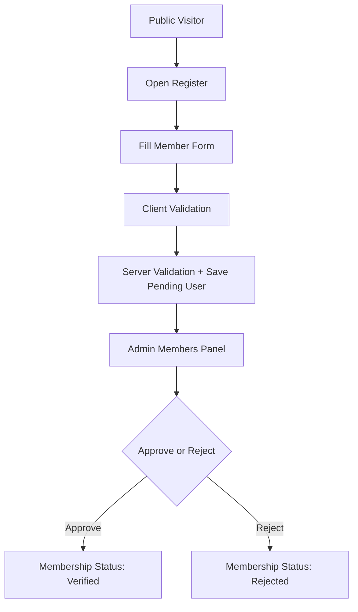
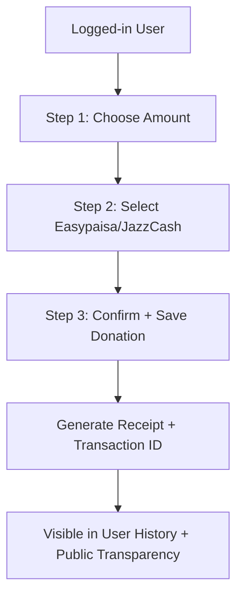
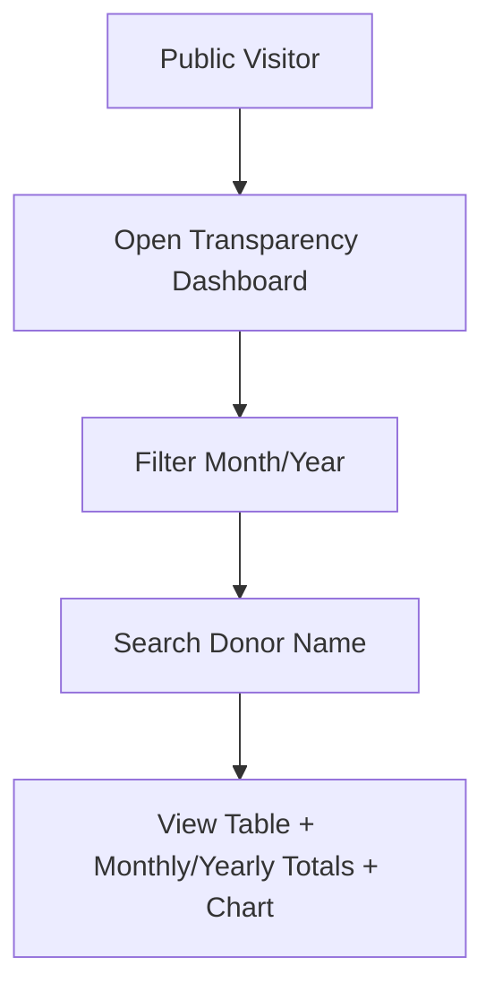
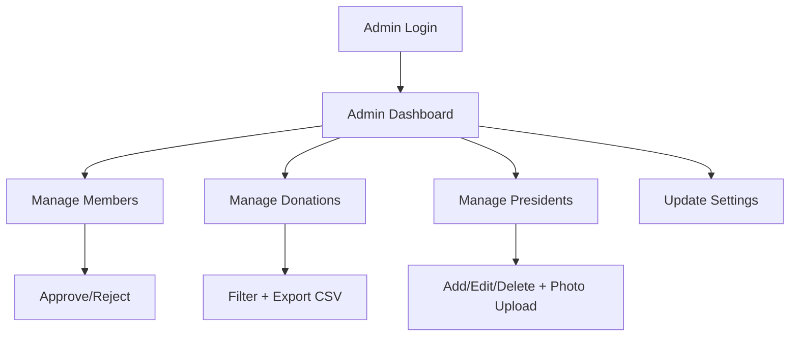

# KSWO User Flow Diagrams

## 1) Member Registration + Verification

```mermaid
flowchart TD
A[Public Visitor] --> B[Open Register]
B --> C[Fill Member Form]
C --> D[Client Validation]
D --> E[Server Validation + Save Pending User]
E --> F[Admin Members Panel]
F --> G{Approve or Reject}
G -->|Approve| H[Membership Status: Verified]
G -->|Reject| I[Membership Status: Rejected]
```

## 2) Monthly Donation (Max 3 Steps)

```mermaid
flowchart TD
A[Logged-in User] --> B[Step 1: Choose Amount]
B --> C[Step 2: Select Easypaisa/JazzCash]
C --> D[Step 3: Confirm + Save Donation]
D --> E[Generate Receipt + Transaction ID]
E --> F[Visible in User History + Public Transparency]
```

## 3) Public Transparency Access

```mermaid
flowchart TD
A[Public Visitor] --> B[Open Transparency Dashboard]
B --> C[Filter Month/Year]
C --> D[Search Donor Name]
D --> E[View Table + Monthly/Yearly Totals + Chart]
```

## 4) Admin Operations

```mermaid
flowchart TD
A[Admin Login] --> B[Admin Dashboard]
B --> C[Manage Members]
B --> D[Manage Donations]
B --> E[Manage Presidents]
B --> F[Update Settings]
C --> C1[Approve/Reject]
D --> D1[Filter + Export CSV]
E --> E1[Add/Edit/Delete + Photo Upload]
```
